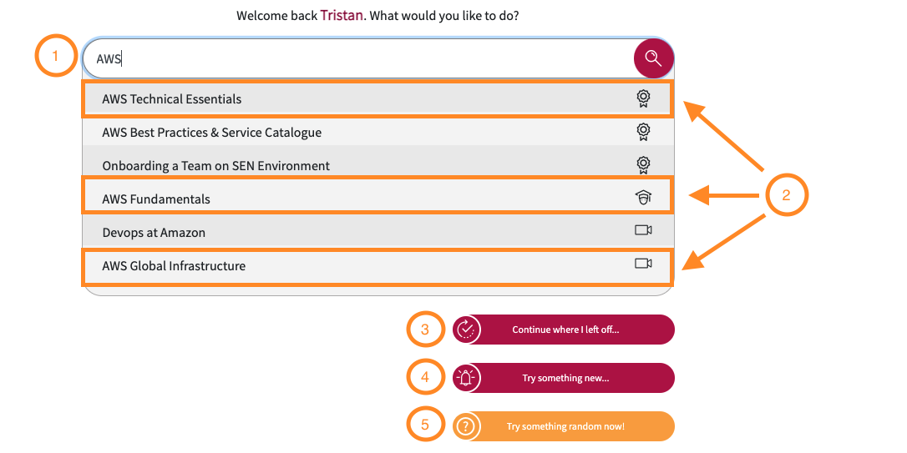

# **The Manabu Quick Access Menu**

1. You can enter any text into the search bar:
This will have Manabu search all content types that match the given criteria you have entered. In this example, we have searched for all content types that match 'AWS'.
1. There are three different content types, all three are shown in the search results above:
* Course (Noted as 'AWS Technical Essentials' in the above image)
* Assessment (Noted as 'AWS Fundamentals' in the above image)
* Stand Alone Videos (Noted as 'AWS Global Infrastructure' in the above image)
These Content Types are broken down into more detail in their respective FAQ sections.
1. If you have previously enrolled and made progress in a course, you can continue with it by using the 'Continue where I left off...' shortcut.
1. The 'Try something new...' shortcut will take you to the most recent content type that has been uploaded to the platform.
1. The 'Try something random now!' shortcut will randomise a content type and take you to that entry.
1. In order to create content, you need to be an admin.
If you are not an admin, you can simply use the 'here' link to send a request to be one.