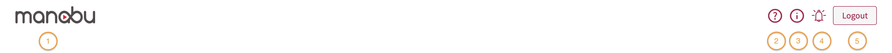

# __Manabu Header__

* This is the logo of the application which also allows you to return to the main page upon clicking.
* Upon clicking of this button it will redirect you to a frequently asked questions page, which provides you with detailed view of the application.
* It is button used to switch user from an administrator to a standard user of the application.
* Upon clicking, you will be presented with notifications
A button that logs out the user